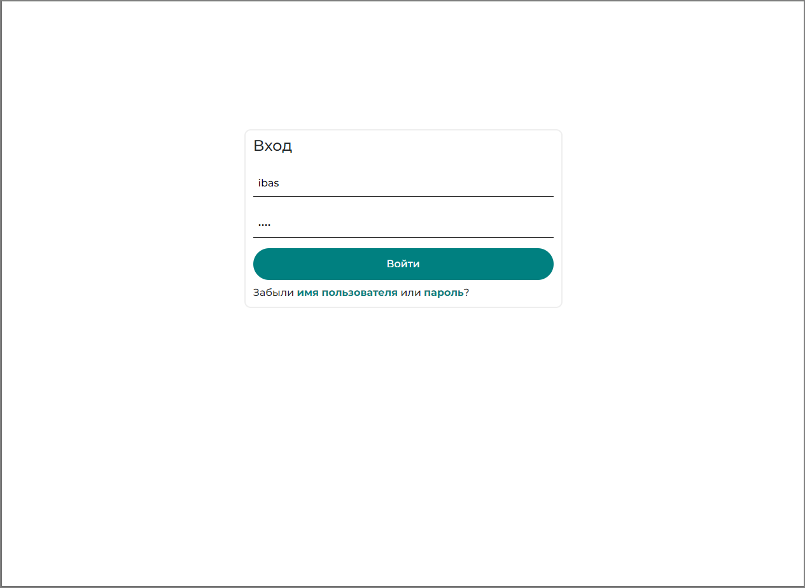
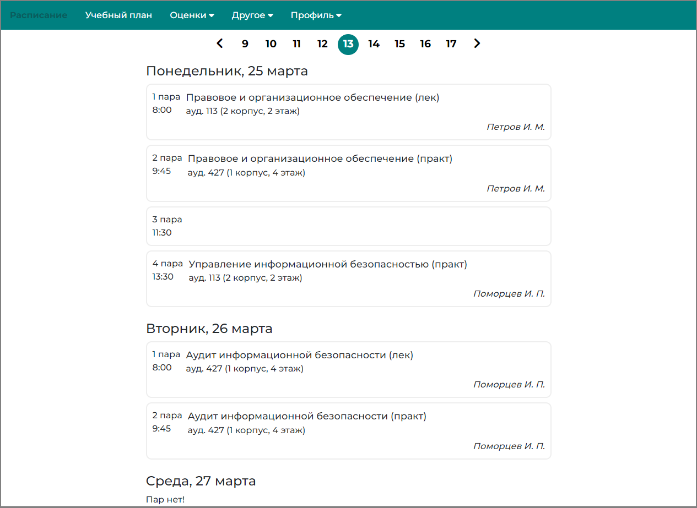
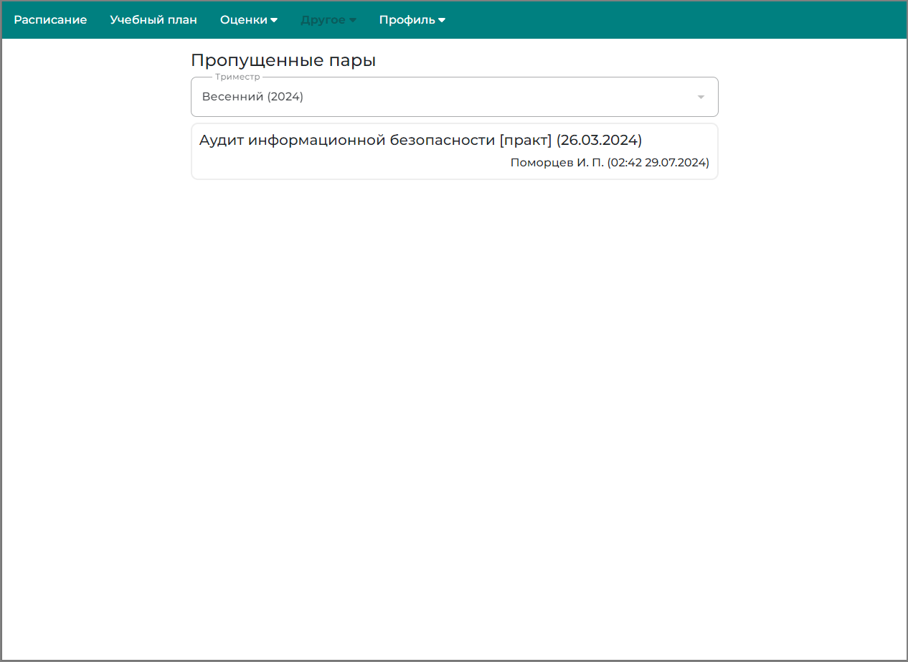
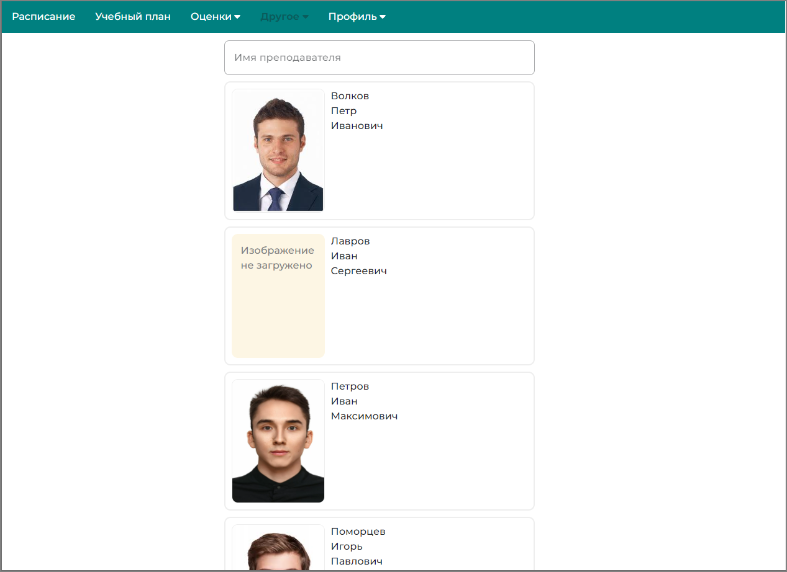
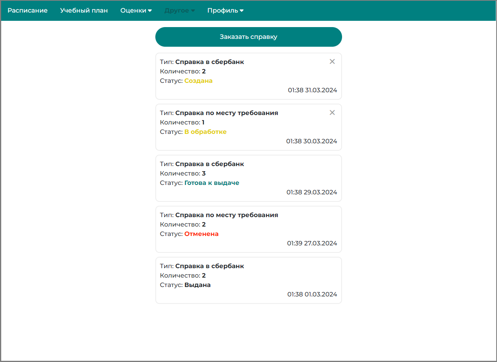
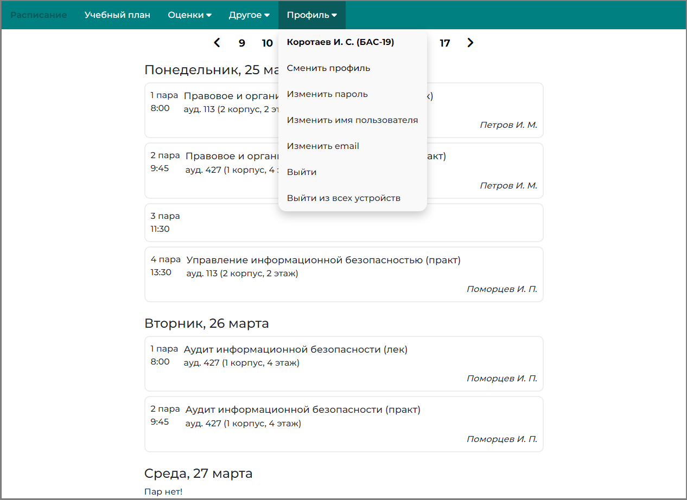

# Приложение по управлению учебным процессом

#### Данное приложение разработано в рамках выпускной квалификационной работы.
В данном репозитории содержится реализация __клиентской части приложения__.
Реализация __серверной части приложения__ расположена в другом [репозитории](https://github.com/vkorootaev1/ems).

## Реализация
Клиентская часть приложения реализована в виде адаптивного веб-приложения 

## Краткий функционал приложения
В данном проекте реализован функционал для студентов, преподавателей и системных администраторов учебного заведения
### Функционал преподавателей
- Просмотр расписания
- Учет успеваемости и посещаемости студентов
- Создание информационных объявлений для студентов (с возможностью загрузки файлов)
- Изменение контактной информации
### Функционал студентов
- Просмотр расписания
- Просмотр учебного плана
- Просмотр промежуточных и итоговых оценок по дисциплинам
- Просмотр посещаемости
- Просмотр информационных объвлений от преподавателей
- Просмотр расписания преподавателя и его контактной информации
- Заказ справок, связанной с учебным заведением
### Функционал системных администраторов
- Просмотр, редактирование, анализ любой информации, связанной с учебным процессом
- Просмотр журнала событий действий пользователя
### Другой функционал
- Авторизация
- Изменение имени пользователя, пароля, электронной почты
- Сброс имени пользователя, пароля
- Выход из системы
- Выход из системы из всех устройств

## Пользовательский интерфейс
*Авторизация*

*Расписание*

*Расписание (мобильная версия)*

*Учебный план*

*Промежуточные оценки студентов*

*Промежуточные оценки студентов (мобильная версия)*

*Итоговые оценки студентов*

*Итоговые оценки студентов (мобильная версия)*

*Посещаемость*

*Преподаватели*

*Информация о преподавателе (мобильная версия)*

*Справки*

*Заказ справки*

*Объявления от преподавателей*

*Профиль*

*Изменение пароля*

*Учет успеваемости студентов*

*Учет посещаемости студентов*

*Редактирование контактов преподавателя*

*Добавление контактов преподавателя*

